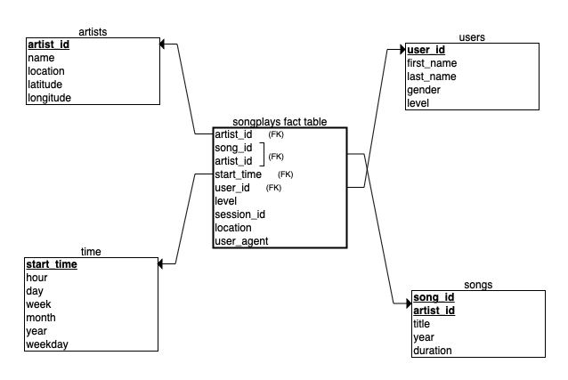

# Data Modeling with Postgres 

In this project, I created an ETL pipeline in Python based on a star schema optimized to analyze user activity in a music streaming app. The ETL pipeline creates a Postgres database and populates it by quering data from two local directories that contain JSON metadata on the songs and on the logs of user activity in the app. 

## Database Schema Design

Because we want to analyze user activity with regards to which songs they listen to, the fact table is organized around the data we are interested in augmented by four dimension tables:

**Fact Table**

`songplays` - records in log data associated with song plays i.e. records with page NextSong

**Dimension Tables**

`users` - information about users in the app  
`songs` - information about songs in music database  
`artists` - information about artists in music database   
`time` - timestamps of records in songplays broken down into specific units (day, week, year, etc)  

Such a design allows quick aggregations to answer different business questions (e.g. what songs are most listened to? etc).

## Instructions:

1. Run the following commands in a terminal in the project's root directory:

    - `python create_tables.py` to create a database 
    - `python etl.py` to run ETL pipeline that preprocesses data according to the ERD schema and populates the database  

    **Note**: you will need to configure the environment for running the scripts on your local machine. To see how read the post ["Running Cassandra and PostgreSQL in Docker"](https://www.cross-validated.com/Running-Cassandra-and-Postgres-in-Docker/) on my blog [Cross-Validated](https://www.cross-validated.com)
    
2. To see the results and query sparkifydb run `test.ipynb`. 
   
   **Note**: restart this notebook to close the connection to your database. Otherwise, you won't be able to run your code in `create_tables.py`, `etl.py`, or `etl.ipynb` files since you can't make multiple connections to the same database (in this case, sparkifydb).
   
   

## Results

**Step 1: CREATE TABLES**
 * Wrote `CREATE` statements in `sql_queries.py` to create each table
 * Wrote `DROP` statements in `sql_queries.py` to drop each table if exists
 * Wrote `INSERT` statements in `sql_queries.py` to populate each table with data according to schema design

**Step 2: BUILD ETL PIPELINE**
 * Developed ETL processes for each table in jupyter notebook `etl.ipynb` and tested the results on one file from each dataset

**Step 2: PYTHON SCRIPT**
 * Converted the jupyter notebook `etl.ipynb` into python script `etl.py` that processes the entire datasets

    
## Acknowledgements
This project is part of [Udacity Data Engineer Nanodegree Programm](https://www.udacity.com/course/data-engineer-nanodegree--nd027).  
Database Schema was created using [ERDplus](https://erdplus.com/standalone)
